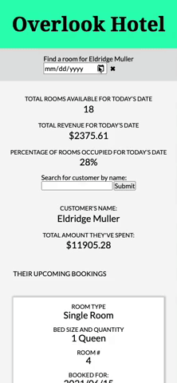

# Overlook Hotel

This web application is a hotel management tool for hotel customers and staff to manage room bookings and calculate customer bills.

The project spec can be found [here](https://frontend.turing.edu/projects/overlook.html).

## Install

1. Clone down the api server `git clone https://github.com/turingschool-examples/overlook-api`
   1. This API holds the data our project will fetch in order to populate the browser with info
2. CD into your local clone `cd overlook-api`
3. Install project dependencies `npm install`
4. Run `npm start`
5. Clone down this repository `git clone https://github.com/alexmkio/overlook-hotel`
6. CD into your local clone `cd overlook-hotel`
7. Install project dependencies `npm install`
8. Run `npm start` and open `localhost:8080` in your preferred browser

## Goals
* Use OOP to drive the design of the application and the code
* Work with an API to send and receive data
* Solidify the code review process
* Create a robust test suite that thoroughly tests all functionality of a client-side application

## Features

### Screenshot showing customer login and daskboard

### Screenshot demonstrating booking a room, the confirmation message, and the customers price spent increasing

### Screenshot showing manager login and dashboard

### Screenshot demonstrating customer search by manager, deleting a customer's future booking, and a confirmation message

### Screenshot showing demonstrating a manager booking a date for a customer, a confirmation message, and their total spent increasing

### Screenshot showing error message when a search is performed for a name that can not be found

### Screenshot showing error message when an invalid username and password are used to login

### Screenshot showing showing responsiveness across desktop, tablet, and mobile

## Contributors

This application was written by [Alex Kio](https://github.com/alexmkio); a Mod 2 frontend engineering student at [Turing School of Software & Design](https://turing.edu/).

## Technologies Used

This application uses vanilla JavaScript, HTML, and SCSS. Mocha and Chai are used as the testing suite. Webpack is used to bundle the javascript and as the SASS compiler. GitHub and Git are used for version control and collaboration. HTTP Request is being used to Get, Post, and Delete.
